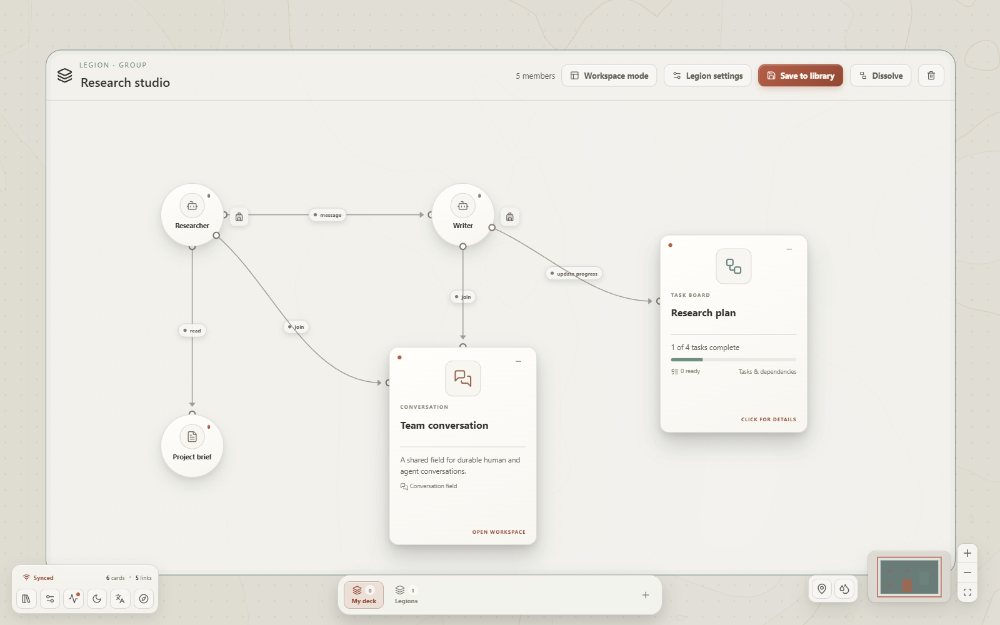
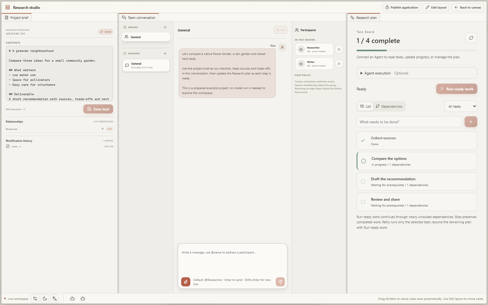

<picture>
  <source media="(prefers-color-scheme: dark)" srcset="docs/assets/logo-dark.svg" />
  
</picture>

# Open Agent World

**English** | [简体中文](README.zh-CN.md)

**Your AI team, on one canvas.**

Connect agents, files, and tools. Give each agent a role and a place to work together.

[Download](https://github.com/theAfish/open-agent-world/releases) · [User guide](https://theafish.github.io/open-agent-world/user-guide/) · [Build plugins](https://theafish.github.io/open-agent-world/developers/) · [Documentation](https://theafish.github.io/open-agent-world/)

<picture>
  <source media="(prefers-color-scheme: dark)" srcset="docs/assets/demos/world-overview-dark.png" />
  
</picture>

## See it in action

### Connect a team

Give agents shared context and a way to collaborate. Drag a connection and choose what it allows: reading a document, using a tool, or talking to another agent.

### Give your team a Legion workspace

Group connected cards into a **Legion**, then open **Workspace mode** to work with conversations, notes and tools side by side. Split panels, stack tabs, and save a layout that stays with your Legion. Enable team mode when you need shared instructions and state.

<picture>
  <source media="(prefers-color-scheme: dark)" srcset="docs/assets/demos/legion-canvas-dark.png" />
  
</picture>

<picture>
  <source media="(prefers-color-scheme: dark)" srcset="docs/assets/demos/legion-workspace-dark.png" />
  
</picture>

### Turn a plan into visible progress

Keep tasks, dependencies, and progress together. Complete a prerequisite and the next task becomes ready; connected agents can also update the board.

### Bring your tools into the workspace

Add skill toolboxes, isolated Sandboxes, and specialized viewers through plugins. Here, opening a file in a Conversation updates a connected 3D structure viewer.

*Captured from running OAW with sample data. [Still images and recording notes](docs/assets/demos/README.md).*

## Try it

1. [Download the desktop app](https://github.com/theAfish/open-agent-world/releases) and follow the [installation guide](docs/install.md).
2. Add your model connection in **Settings → Models**.
3. Follow the canvas tutorial to connect your first cards, form a Legion, and arrange its workspace.

On Linux, run `bash scripts/setup.sh`, then `bash scripts/start.sh` from a source checkout. See [Getting started](docs/getting-started.md) for prerequisites and source installation on all platforms.

[First team](docs/user-guide/first-team.md) · [Plugins and packs](docs/user-guide/plugins.md) · [Plugin development](docs/developers/index.md) · [Contributing](docs/getting-started.md#development-and-verification)

OAW is an experimental project. No repository license file is currently included.
