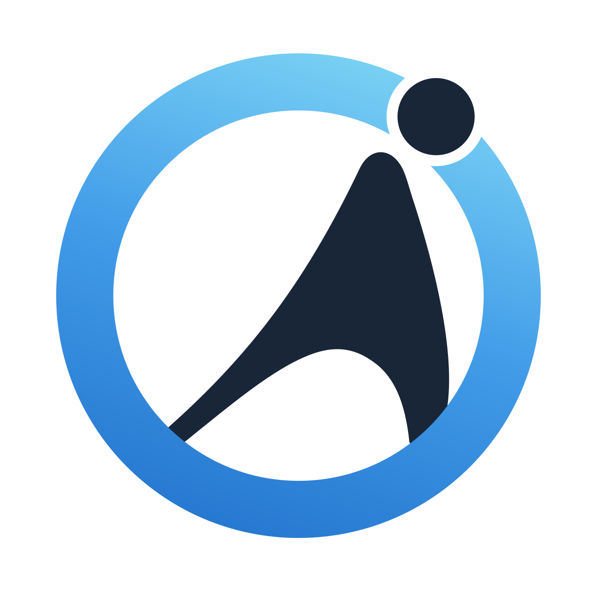

<div align="center">



# Open Agent World

**Build agents. Bring them together. Give them a world to work in.**

A visual workspace where AI agents, tools, and resources become cards you can connect.

[Get started](docs/getting-started.md) / [Documentation](docs/README.md) / [Plugins](docs/plugins.md)

</div>

> **World preview**: screenshot or short demo GIF coming soon.
<!-- Replace this placeholder with a committed image showing a small working world. -->

## What can I do?

- **Build an Agent.** Choose a model, give it instructions, and connect the resources and tools it can use.
- **Build a Team.** Connect agents, organize them into reusable Legions, and coordinate work with a Task Board.
- **Build a World.** Arrange shared documents, toolboxes, and isolated Sandboxes on an open canvas. Add new kinds of cards through plugins.

## Quick Start

Clone this repository and run from its root. You need **Python 3.11+**, **uv**, and **Node.js 20+**.

**Windows (PowerShell)**

```powershell
./scripts/setup.ps1
./scripts/start.ps1
```

**Linux / WSL2**

```bash
bash scripts/setup.sh
python3 scripts/start.py
```

Open the local URL printed by the launcher. In **Settings > Models**, add a connection and model, then choose a default. Open **Pack & Card Library** to collect cards and add them to your deck.

See [Getting started](docs/getting-started.md) for setup details, macOS limitations, and trying the canvas without model credentials.

For development, use `./scripts/dev.ps1` or `python3 scripts/dev.py`, then press **F3** for selective state resets and stress cards. Development uses a separate profile; existing daily-use data stays in its original location. See [Desktop installation and development](docs/desktop.md) for the Windows installer, release preview, profile locations, and recovery backups.

## The mental model

**Cards are things. Connections grant access. The canvas is your world.** An Agent can use the resources its connections allow; changing a connection changes that access. [Explore the concepts](docs/concepts.md)

## Learn and explore

- **[Interactive Tutorial](docs/tutorial.md).** Start from the empty canvas with the OAW guide, or use the compass button to replay navigation, cards, connections, sticking, and the Minister.
- **[Docs](docs/README.md)**: feature usage, configuration, and technical reference you can read as needed.
- **[Plugins](docs/plugins.md)**: use bundled extensions or develop your own cards, capabilities, and runtime integrations.

## Contributing and License

Bug reports, documentation improvements, and focused changes are welcome. See [development and verification](docs/getting-started.md#development-and-verification) before submitting changes.

OAW is a local experimental project. No repository license file is currently included.
