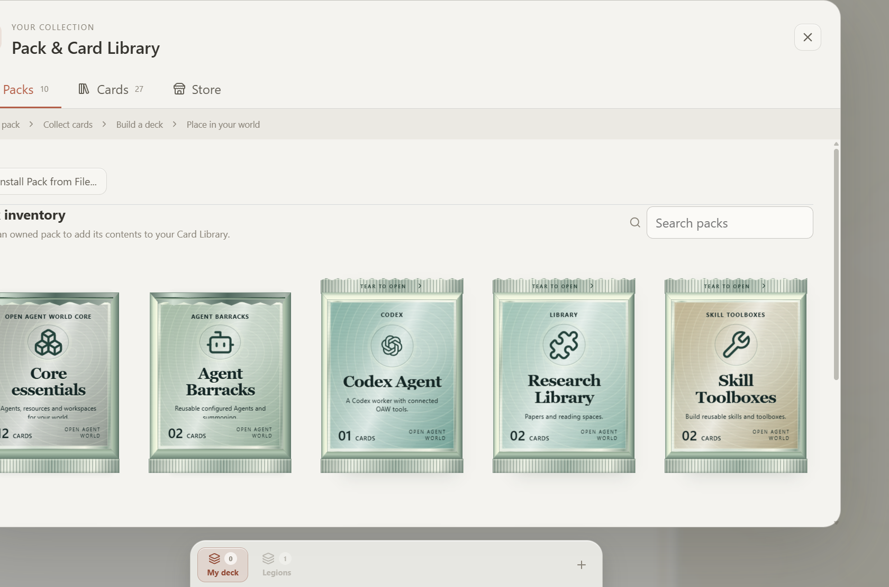
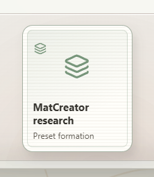
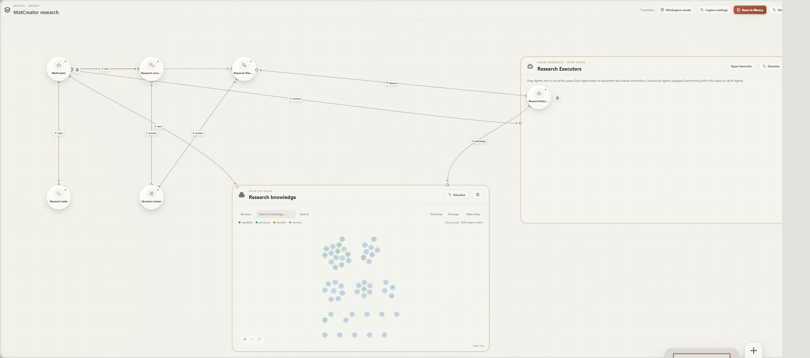
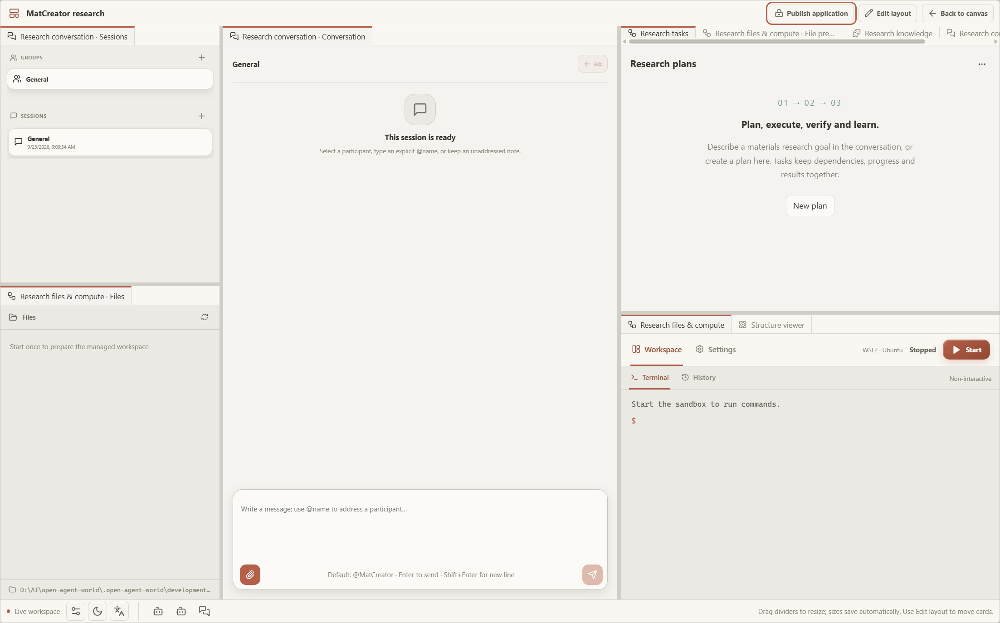

# MatCreator 预设 Legion：从零开始

[English documentation](../../plugins/matcreator/README.md) | **简体中文**

本示例从一个空白世界开始，使用 MatCreator 的 **MatCreator research** 预设创建一个材料研究工作区。你会依次完成：

1. 从 MatCreator 卡包收集卡牌。
2. 把卡牌加入自己的牌组。
3. 把 **MatCreator research** Legion 预设加入牌组。
4. 从牌组把预设拖到画布。
5. 打开 Legion 的 **Workspace mode（工作区模式）**。
6. 使用会话、任务板、文件、Sandbox 和 Research knowledge 完成一次研究流程。

下面的截图由当前源码版本在 2026-09-23 的本地 mock runtime 中重新录制，分别对应卡包获取、预设入口、画布和工作区状态。

> [!IMPORTANT]
> MatCreator 预设属于插件注册的 **Legions** 项目，不是普通卡包中的单张卡牌。普通卡包提供可单独放置的 Agent、Sandbox 等卡牌；预设会一次性部署一组已经连接好的研究卡牌。两者可以同时放入同一个牌组。

## 0. 准备环境

### 安装并启动 OAW

安装 MatCreator 插件后重启 OAW。插件还依赖 `science.structure-viewer`，正常的本地插件发现会一起加载它。开发环境可以在仓库根目录运行：

```powershell
./scripts/dev.ps1
```

打开启动器输出的本地地址。首次体验可以使用 mock Agent runtime，不需要模型凭据：

```powershell
./scripts/dev.ps1 -AgentRuntime mock
```

mock runtime 只用于验证界面和流程，不会生成真实的模型回答。要进行真实研究，请先在 **Settings > Models** 配置默认模型。

### 从空白世界开始

如果页面显示首次启动选项，选择 **Start Empty（空白开始）**。如果已经进入其他世界，可以使用应用的重置/新建工作区功能，或继续使用当前世界；下面的收集和牌组操作不会自动删除已有卡牌。

## 1. 打开 MatCreator 卡包

1. 打开世界控制区的 **Pack & Card Library（卡包与卡牌库）**，也可以点击底部牌组托盘中的 **Library**。
2. 切换到 **Packs** 标签，找到 MatCreator 卡包。
3. 点击密封卡包。打开卡包会把其中的卡牌收集到你的 Card Library；它不会自动把卡牌放进当前牌组。
4. 切换到 **Cards** 标签，搜索 `MatCreator`，逐张查看可用卡牌。

卡包的职责是“收集卡牌”，牌组的职责是“选择当前底部托盘显示哪些卡牌”。收集动作只做一次；之后可以把同一张已收集卡牌加入或移出不同的牌组。

## 2. 创建牌组并加入卡牌

1. 在 **Decks** 标签创建一个牌组，例如命名为 `MatCreator demo`。
2. 回到 **Cards**，选中需要直接放置或单独配置的卡牌，点击 **Add to deck**，选择 `MatCreator demo`。
3. 至少可以加入一个 Agent、一个 Conversation 和一个 Sandbox。若只想体验预设工作区，也可以先跳过这些卡牌；预设部署时会创建自己的成员。
4. 点击牌组标签激活 `MatCreator demo`。

现在底部托盘显示的是这个牌组的内容。加入牌组不会在画布上创建实例，只有从托盘点击或拖拽卡牌时才会创建世界卡牌。



## 3. 把 MatCreator 预设加入牌组

MatCreator 预设位于牌组托盘的 **Legions** 标签。它与普通卡包采用不同的来源，但加入牌组后的使用方式相同：

1. 点击底部托盘的 **Legions** 标签。
2. 找到 **MatCreator research**。
3. 将它拖到 `MatCreator demo` 牌组的标签上，或打开预设详情后选择 **Add to deck**。
4. 切回 `MatCreator demo`，确认牌组中出现 `MatCreator research`。

将预设放进牌组只保存一个可部署的 Legion 项目，不会马上在画布上创建它。预设包含一组固定的初始成员和连接：Conversation、Sessions、Files、Research tasks、File preview、Research knowledge、Sandbox、Structure viewer 以及 MatCreator Agent。



## 4. 从牌组拖到画布

1. 保持 `MatCreator demo` 为当前激活牌组。
2. 在底部托盘找到 **MatCreator research**。
3. 将它拖到画布的空白区域并释放。也可以点击该项目，让 OAW 使用默认位置放置。
4. 等待 Legion 和成员卡牌完成创建，然后点击 **Fit view** 查看完整布局。

预设部署的是一个新的 Legion 实例。牌组里的预设仍然可以再次使用；每次放置都会创建独立的实例。画布上的 Legion 卡牌与牌组中的预设不是同一个对象，删除画布实例不会删除牌组内容。

首次部署后，检查 Legion 内是否能看到研究相关成员。如果插件刚安装或刚更新，重启后端和前端，再重新打开页面；旧的已部署 Legion 不会被静默替换成新版本。



## 5. 打开 Workspace mode

1. 在画布上找到 **MatCreator research** Legion 的标题栏。
2. 点击 **Workspace mode（工作区模式）**。
3. 工作区会以一个模块化窗口打开。点击标签可以在不同页面之间切换；这些页面仍然属于同一组 Legion 成员。

预设默认布局大致如下：

- 左侧：Sessions、Files。
- 中间：Conversation。
- 右侧标签：Research tasks、File preview、Research knowledge、Participants。
- 下方或右下方标签：Sandbox 控制、设置、Terminal、Structure viewer。



需要调整布局时：

1. 点击 **Edit layout**。
2. 把成员或已有标签拖到面板的左、右、上、下边缘进行分栏；拖到标题栏可以加入同一组标签。
3. 完成后点击 **Save layout** 或 **Done editing**。
4. 不需要的成员仍可留在 Legion 中，不必全部放进工作区；它们会继续保留在底部栏。

工作区只是 Legion 成员的另一种展示方式。它不会改变画布位置、连接、模型设置或 Sandbox 的运行状态。

## 6. 第一次使用：建立研究计划

### 6.1 配置会话和 Agent

1. 在 **Sessions** 中创建或选择一个会话。
2. 在 **Conversation** 中输入研究目标，例如：

   > Plan a copper supercell study. Inspect the available scientific environment, record the steps in the task board, generate the structure when ready, verify its atom count and publish the output paths.

3. 在 Agent 的设置中确认默认模型。没有模型凭据时，可以先观察界面和任务板，不要期待真实模型回复。
4. 如果要执行计算，在 Sandbox 中配置运行时、环境和工作目录，然后再点击 **Start**。预设不会自动绑定主机目录、凭据、Python 包或自动启动 Sandbox。

### 6.2 在 Research tasks 中创建任务

1. 打开 **Research tasks**。
2. 点击 **New plan**，填写计划标题和研究目标。
3. 使用 **Add task** 添加任务，例如：
   - Inspect the scientific environment
   - Generate a 2 × 2 × 2 copper supercell
   - Verify the atom count
   - Publish the output files
4. 为任务填写依赖关系、验收标准和结果记录。
5. 按照 **To do → In progress → Awaiting review → Done** 推进状态。

任务板按当前 Conversation session 隔离。切换会话会看到该会话自己的计划；回到原会话时，计划和执行记录会恢复。将任务标记为 **Done** 前，应检查实际文件并记录证据；状态变更本身不会自动启动或取消 Run。

### 6.3 使用文件、知识和结构预览

- 在 **Files** 查看 Sandbox 工作目录中的输入和输出。
- 在 **File preview** 打开结构文件或其他资源。
- 在 **Structure viewer** 检查已打开结构的原子数和几何形状。
- 在 **Research knowledge** 搜索 MatCreator 的科学技能和参考知识。
- 通过 Conversation 继续澄清目标、修订计划并记录结果。

预设中的科学技能存放在 Research knowledge；它们不会因为打开工作区就自动执行。真实计算仍需要正确配置的 Sandbox 环境和可用模型。

## 7. 保存与再次使用

- 当前 Legion 的工作区布局会自动保存；编辑布局时可以使用 **Cancel layout changes** 放弃本次修改。
- 要把修改后的布局保存成新的可复用版本，在 Legion 操作中选择 **Save to library**。
- 已保存的版本会出现在 **Legions** 标签，可加入牌组并再次部署。
- 保存到库的是布局和可复用的任务结构；运行结果、会话引用和输出路径不会被复制成新项目的实时结果。
- 删除画布上的 Legion 实例不会影响已收集卡牌、牌组或库中的预设。

## 常见问题

### 找不到 MatCreator 卡包或预设

确认插件已经安装并重启后端。卡包需要在 **Packs** 中点击打开；预设则应在 **Legions** 标签中查找，而不是在普通 **Cards** 列表中搜索。前端资源更新后也需要重新构建或刷新页面。

### 牌组里有预设，但拖不出完整工作区

先确认拖的是 `MatCreator research` Legion 项目，而不是单独的 Agent 或 Toolset。放置后点击 **Fit view**，再从 Legion 标题栏打开 **Workspace mode**。

### 工作区里看不到 Structure viewer

该功能依赖 `science.structure-viewer` 插件，并且只有在 Conversation 或 Sandbox 中打开结构文件后才会显示有内容的预览。先检查插件加载状态，再通过 **File preview** 打开 `.xyz` 或 `.cif` 文件。

### Agent 没有回复或 Sandbox 无法运行

检查默认模型、Agent 的模型设置、Sandbox runtime/environment 和工作目录。mock runtime 只验证本地交互，不提供真实模型能力；安装 OAW 也不会自动安装 ASE、NumPy 等科学依赖。

## 相关文档

- [MatCreator 插件说明（英文）](../../plugins/matcreator/README.md)
- [Legion、团队空间与工作区（英文）](../legions.md)
- [卡包、卡牌库与牌组（英文）](../card-library.md)
- [Sandbox 工作区（英文）](../sandbox-workspace.md)
